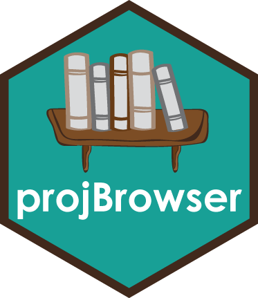
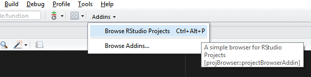
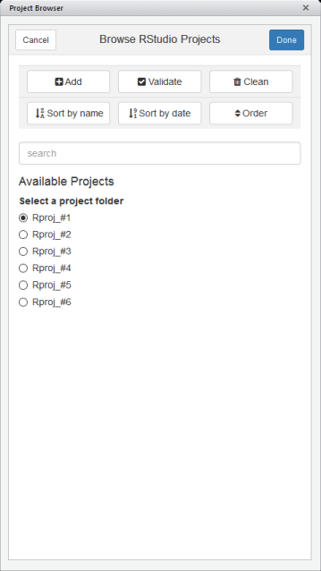

<!-- README.md is generated from README.Rmd. Please edit that file -->

# projBrowser <a href='https://tzerk.github.io/projBrowser/'></a>

<!-- badges: start -->

[](https://ci.appveyor.com/project/tzerk/projbrowser)
[](https://travis-ci.org/tzerk/projBrowser)
<!-- badges: end -->

> [Find a full documentation of the package on the project
> page](https://tzerk.github.io/projBrowser/)

## Overview

`projBrowser` is a simple [RStudio
Addin](http://rstudio.github.io/rstudioaddins/) that facilitates the
management of [RStudio
Projects](https://support.rstudio.com/hc/en-us/articles/200526207-Using-Projects).

## Requirements

[RStudio Desktop](https://www.rstudio.com/products/rstudio/download/) ≥
0.99.896

## Installation

This package can be installed directly from GitHub via the
[`devtools`](https://cran.r-project.org/web/packages/devtools/index.html)
package:

``` r
if(!require("devtools"))
  install.packages("devtools")
devtools::install_github("tzerk/projBrowser")
```

## Usage

The RStudio IDE automatically registers all available addins on startup.
Once the package has been installed you should see the Addins toolbar
menu populated with the addins exported by this package:



For easier access I recommend adding a keyboard shortcut for the addin
(e.g., `Ctrl+Alt+P` as shown in the image). Keyboard shortcuts can be
added or modified under `Addins >> Browse Addins >> Keyboard Shortcuts`.

## Note

In order to keep track of available RStudio projects this addin
automatically creates a file in the package’s library folder
(`~/.../projBrowser/proj/projects.txt`).

This addin was developed and tested on Windows only and hence cannot
guarantee that it works on Linux or Mac OS.

## Gallery



## License

The `projBrowser` package is licensed under the GPLv3. See these files
in the main directory for additional details:

LICENSE - projBrowser package license (GPLv3)
